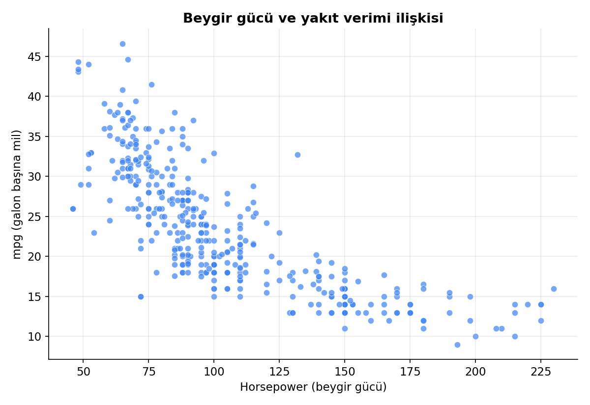
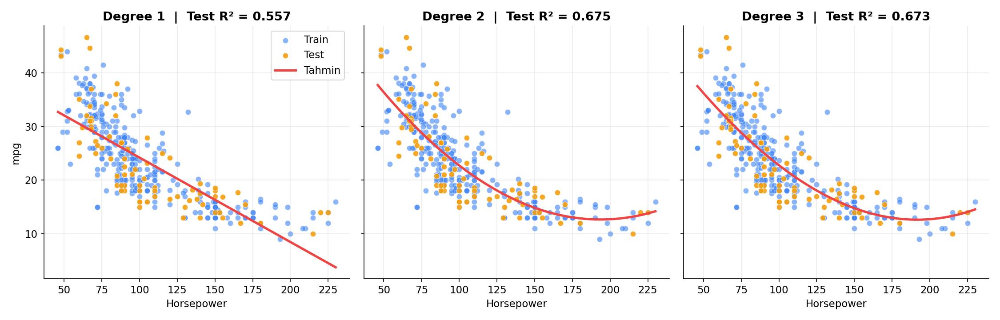
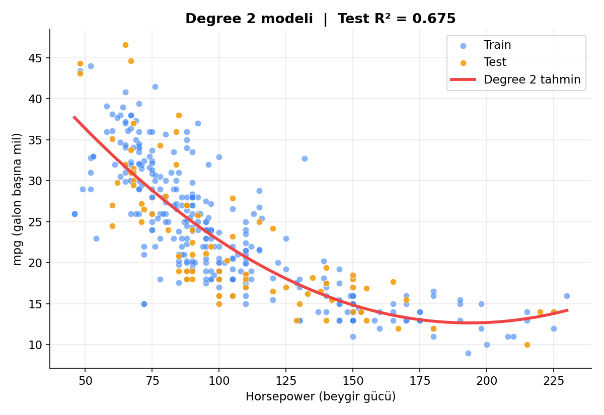

<div align="center">

# 🚗 Polinom Regresyon ile Yakıt Verimi Tahmini

**Beygir gücü arttıkça yakıt verimi nasıl değişiyor? Doğrusal ve polinom regresyonu karşılaştırdım.**


</div>

---

## 📌 İçindekiler

- [Proje Özeti](#-proje-özeti)
- [Veri Seti](#-veri-seti)
- [Yöntem](#-yöntem)
- [Sonuçlar](#-sonuçlar)
- [Ne Öğrendim?](#-ne-öğrendim)
- [Sınırlılıklar](#-sınırlılıklar)
- [Gelecek Adımlar](#-gelecek-adımlar)
- [Kurulum ve Çalıştırma](#-kurulum-ve-çalıştırma)
- [Proje Yapısı](#-proje-yapısı)
- [İletişim](#-iletişim)

---

## 🎯 Proje Özeti

Bir arabanın **beygir gücü (`horsepower`)** ile **yakıt verimi (`mpg`, galon başına mil)** arasındaki ilişki düz bir çizgi değil, **içe doğru kıvrılan bir eğri** çiziyor. Düşük beygirli arabalarda yakıt verimi hızla düşerken, güçlü arabalarda düşüş yavaşlıyor.

Bu projede şu soruya cevap arıyorum:

> **Bu eğriyi yakalamak için polinom regresyon, doğrusal regresyona göre ne kadar fayda sağlıyor ve hangi derecede durmak mantıklı?**

<div align="center">
  
  <p><i>Şekil 1: Beygir gücü ve yakıt verimi arasındaki ilişki eğri şeklinde.</i></p>
</div>

---

## 📊 Veri Seti

| Özellik | Değer |
|---|---|
| **Kaynak** | Seaborn `mpg` veri seti (Auto MPG) |
| **Toplam araç sayısı** | 398 |
| **Temizlik sonrası** | 392 (`horsepower` sütunundaki 6 boş değer silindi) |
| **Kullanılan sütunlar** | `horsepower` (girdi), `mpg` (hedef) |

### Sütun açıklamaları

| Sütun | Anlamı | Rolü |
|---|---|---|
| `horsepower` | Arabanın beygir gücü | **X (girdi)** |
| `mpg` | Bir galon yakıtla gidilen mil (yüksek = daha az yakıt harcar) | **y (hedef)** |

Veriyi yüklemek için ekstra indirme gerekmiyor:

```python
import seaborn as sns
df = sns.load_dataset("mpg")[["horsepower", "mpg"]].dropna()
```

---

## 🛠 Yöntem

Proje aşağıdaki adımlarla ilerliyor:

1. **Keşifsel analiz:** `head()`, `info()` ve scatter grafiği ile veriye bakış
2. **Veri temizleme:** Boş değerlerin silinmesi (`dropna()`)
3. **Train-test ayrımı:** %80 eğitim, %20 test (`random_state=15`)
4. **Ölçekleme:** `StandardScaler` (yalnızca eğitim verisine `fit`)
5. **Modelleme:** `LinearRegression` ve `PolynomialFeatures` (degree 1, 2, 3, 4)
6. **Değerlendirme:** Test verisi üzerinde **R² skoru**
7. **Pipeline:** Ölçekleme, polinom dönüşümü ve regresyonu tek bir `Pipeline` içinde birleştiren `poly_regression(degree)` fonksiyonu

```python
def poly_regression(degree):
    pipeline = Pipeline([
        ("scaler", StandardScaler()),
        ("poly", PolynomialFeatures(degree=degree)),
        ("lin_reg", LinearRegression())
    ])
    pipeline.fit(X_train, y_train)
    print("Degree", degree, "R2:", round(pipeline.score(X_test, y_test), 3))
```

---

## 📈 Sonuçlar

| Model | Test R² | Yorum |
|---|:---:|---|
| Doğrusal (degree 1) | 0.557 | Eğriyi yakalayamıyor |
| **Polinom (degree 2)** | **0.675** | **En iyi sonuç** ✅ |
| Polinom (degree 3) | 0.673 | Ek fayda yok |
| Polinom (degree 4) | 0.668 | Hafif düşüş |

<div align="center">
  
  <p><i>Şekil 2: Degree 1, 2 ve 3 tahmin eğrilerinin karşılaştırması.</i></p>
</div>

### 🔍 Bulgular

- Degree 1'den 2'ye geçince R² skoru **0.557'den 0.675'e** çıktı (**+0.118**).
- Degree 2'den sonra derece artırmak skoru iyileştirmedi, hatta hafifçe düşürdü.
- Bu veri için **degree 2 en dengeli seçim**.

<div align="center">
  
  <p><i>Şekil 3: Degree 2 modelinin yeni veri üzerindeki tahmin eğrisi.</i></p>
</div>

---

## 💡 Ne Öğrendim?

- Veri eğri şeklindeyse **doğrusal model yetersiz kalıyor**, polinom özellikler bunu düzeltiyor.
- **Derece artırmak her zaman daha iyi sonuç vermiyor.** Gereksiz karmaşıklık, skoru artırmadan modeli yalnızca daha karmaşık hâle getiriyor.
- Ölçekleyicinin **sadece eğitim verisinden öğrenmesi** gerekiyor (`fit_transform` eğitime, `transform` teste).
- `Pipeline` kullanmak, tüm adımları düzenli ve tekrar kullanılabilir hâle getiriyor.

---

## ⚠️ Sınırlılıklar

- Modelde **yalnızca beygir gücü** kullanıldı. Araba ağırlığı, motor hacmi gibi başka özellikler de yakıt verimini etkiliyor.
- En iyi modelin R² değeri yaklaşık **0.68**, yani yakıt veriminin değişiminin kabaca üçte biri bu modelle açıklanamıyor.
- Veri seti nispeten küçük (392 satır) ve tek bir rastgele bölmeyle değerlendirildi. Farklı `random_state` değerleriyle skorlar küçük farklar gösterebilir.

---

## 🚀 Gelecek Adımlar

- [ ] `weight` ve `displacement` sütunları için de aynı analizi yapıp polinomun hangi özellikte fayda sağladığını karşılaştırmak
- [ ] Birden fazla özelliği birlikte kullanan çoklu regresyon denemek
- [ ] Modeli tek bir bölme yerine çapraz doğrulama ile değerlendirmek

---

## ⚙️ Kurulum ve Çalıştırma

```bash
# 1. Depoyu klonla
git clone https://github.com/KULLANICI_ADIN/polynomial-regression-auto-mpg.git
cd polynomial-regression-auto-mpg

# 2. Gerekli kütüphaneleri kur
pip install -r requirements.txt

# 3. Notebook'u aç
jupyter notebook notebook.ipynb
```

### `requirements.txt`

```
pandas
numpy
matplotlib
seaborn
scikit-learn
jupyter
```

---

## 📁 Proje Yapısı

```
polynomial-regression-auto-mpg/
├── README.md
├── notebook.ipynb
├── requirements.txt
└── images/
    ├── scatter.png
    ├── degree_comparison.png
    └── final_prediction.png
```

---

## 📬 İletişim

**Adın Soyadın**

[](https://www.linkedin.com/in/LINKEDIN_KULLANICI_ADIN)
[](https://github.com/KULLANICI_ADIN)

⭐ Projeyi faydalı bulduysan yıldız vermeyi unutma!
